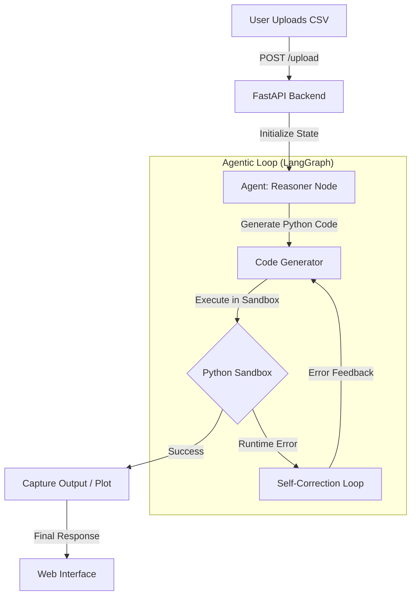

# 📊 Autonomous Data Analyst Agent


> **A Full-Stack Agentic AI application that acts as a Senior Data Scientist.**  
> It doesn't just chat; it autonomously writes, debugs, and executes Python code to analyze raw CSV data and generate professional visualizations.

---

## 🧠 System Architecture

Unlike standard RAG chatbots, this one operates on a **Cyclic Cognitive Architecture**. It uses a "Reason → Code → Observe → Fix" loop to solve complex data problems.



---

## 🚀 Key Capabilities

- **🐍 Autonomous Code Execution**: The agent writes valid pandas and matplotlib code to manipulate data in real-time.
- **🔄 Self-Healing Mechanism**: If the generated code fails (e.g., KeyError), the agent catches the traceback, understands the mistake, and rewrites the code automatically.
- **📊 Dynamic Visualization**: Generates histograms, heatmaps, and scatter plots on the fly, rendering them directly in the chat interface.
- **🛡️ Sandboxed Environment**: Code execution is isolated in a controlled Python `exec()` wrapper to prevent system-level modifications.
- **💻 Full-Stack Design**: Built with a decoupled architecture—FastAPI backend serving a modern HTML5/CSS3 frontend.

---

## 🛠️ Tech Stack

| Component | Technology | Description |
|-----------|-----------|-------------|
| **LLM** | Google Gemini 2.5 Flash | Chosen for high-speed code generation and low latency. |
| **Orchestration** | LangGraph | Manages the cyclic state and decision-making loops. |
| **Backend** | FastAPI | High-performance async REST API. |
| **Frontend** | Vanilla JS / CSS3 | Custom dark-mode UI with markdown rendering and streaming responses. |
| **Data Tools** | Pandas / Seaborn | For data manipulation and statistical visualization. |
| **Infrastructure** | Docker | Fully containerized for reproducible deployments. |

---

## 📦 Installation & Setup

### Option 1: Run with Docker (Recommended)

1. Ensure you have Docker installed.

2. Clone the repository:
```bash
git clone https://github.com/yourusername/autonomous-data-analyst.git
cd autonomous-data-analyst
```

3. Set your API Key:
```bash
export GOOGLE_API_KEY="your_api_key_here"
```

4. Build and Run:
```bash
docker build -t data-agent .
docker run -p 8000:8000 -e GOOGLE_API_KEY=$GOOGLE_API_KEY data-agent
```

5. Access the app at `http://localhost:8000/static/index.html`

### Option 2: Local Development

1. Install Dependencies:
```bash
pip install -r requirements.txt
```

2. Set Environment Variable:
   - **(Linux/Mac)** `export GOOGLE_API_KEY="your_key"`
   - **(Windows)** `set GOOGLE_API_KEY="your_key"`

3. Run the Server:
```bash
uvicorn src.main:app --host 0.0.0.0 --port 8000 --reload
```

### Option 3: Streamlit Interface (Alternative UI)

If you prefer a Streamlit-based interface instead of the default web UI:

1. Follow the setup steps from **Option 2** above.

2. Run the Streamlit app:
```bash
streamlit run src/frontend.py
```

3. Access the Streamlit interface at `http://localhost:8501`

> **Note**: The Streamlit interface provides an alternative user experience with built-in file uploaders and interactive widgets.

---

## 🧪 Usage Examples

Once the UI is running, upload a CSV file (e.g., `hotel_bookings.csv`) and try these prompts:

- **Exploration**: "Show me the first 5 rows and list the data types."
- **Cleaning**: "Check for missing values and tell me which column has the most."
- **Analysis**: "Calculate the cancellation rate for 'Corporate' vs 'Direct' market segments."
- **Visualization**: "Plot a correlation heatmap for all numerical columns."

---

## ⚠️ Limitations & Security

- **API Limits**: The Free Tier of Gemini may hit rate limits (429 errors) during complex debugging loops.
- **Sandboxing**: While the `exec()` environment is restricted, do not run this on public servers without further container isolation.

---

## 📄 License

This project is licensed under the MIT License - see the [LICENSE](LICENSE) file for details.

---

## 🤝 Contributing

Contributions are welcome! Please feel free to submit a Pull Request.

1. Fork the repository
2. Create your feature branch (`git checkout -b feature/AmazingFeature`)
3. Commit your changes (`git commit -m 'Add some AmazingFeature'`)
4. Push to the branch (`git push origin feature/AmazingFeature`)
5. Open a Pull Request

---

## 📧 Contact

For questions or support, please open an issue on GitHub or contact the maintainers.

---
